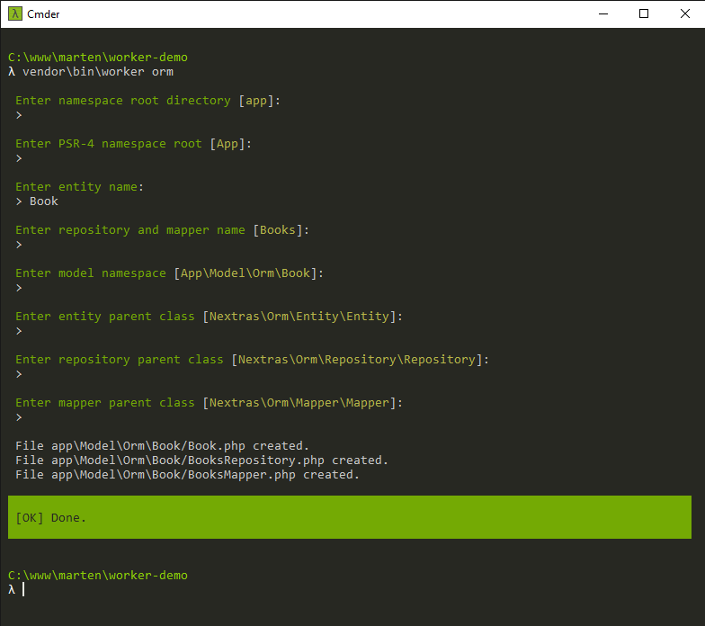

# Worker
Simple interactive worker for doing hard jobs.

## Installation
```shell
composer require adbros/worker --dev
```

## Configuration

```yaml
extensions:
    worker: Adbros\Worker\DI\WorkerExtension
```

## Usage

```shell
php bin/console worker:orm [options] [--] [<entity> [<repository>]]
php bin/console worker:presenter [options] [--] [<name>]
```

## Examples

### ormJob


### presenterJob

