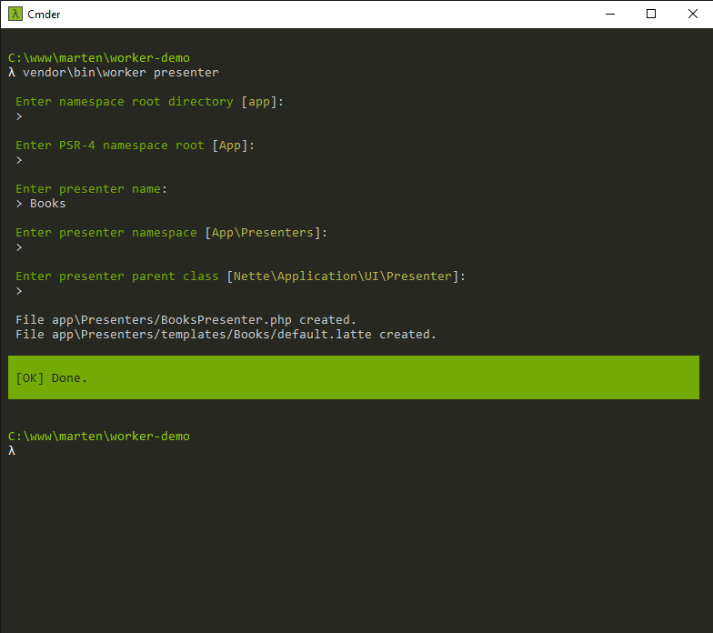

# Worker
Simple interactive worker for doing hard jobs. Inspired by [symfony/maker-bundle](https://github.com/symfony/maker-bundle).

---

[](https://travis-ci.com/adbrosaci/worker)
[](https://coveralls.io/r/adbrosaci/worker)
[](https://packagist.org/packages/adbros/worker)
[](https://packagist.org/packages/adbros/google)
[](https://packagist.org/packages/adbros/worker)
[](https://packagist.org/packages/adbros/worker)

## Installation
```shell
composer require adbros/worker --dev
```

## Configuration
You can create worker.php, worker.json or worker.neon in your root directory to setup default Worker options.

### default worker.neon example
```yaml
rootDirectory: app
rootNamespace: App

command:
    namespace: App\Commands
    parent: Symfony\Component\Console\Command\Command

control:
    namespace: App\Controls
    controlParent: Nette\Application\UI\Control
    factoryParent:

orm:
    namespace: App\Model\Orm
    entityParent: Nextras\Orm\Entity\Entity
    repositoryParent: Nextras\Orm\Repository\Repository
    mapperParent: Nextras\Orm\Mapper\Mapper

presenter:
    namespace: App\Presenters
    parent: Nette\Application\UI\Presenter
```

## Usage

```shell
# Generate command for symfony/console package
vendor/bin/worker command [options] [--] [<name>]

# Generate control with factory and template
vendor/bin/worker control [options] [--] [<name>]

# Generate model for nextras/orm package
vendor/bin/worker orm [options] [--] [<entity> [<repository>]]

# Generate presenter and default template
vendor/bin/worker presenter [options] [--] [<name>]
```

## Examples

### ormJob


### presenterJob

